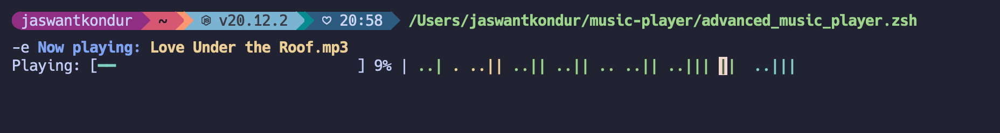

# A Simple Terminal Music Player For Focus

## Dependencies:

1. brew install mpv
2. brew install ffmpeg
3. brew install jq
4. brew install socat

## How to use:

- clone this repo
- Create a folder called music-repo within this itself.
- Add your favourite music into the folder
- Create an alias . For example, I used: `alias focus="$HOME/path/to/advanced_music_player.zsh"` , put it in .zshrc, source it and use the alias to play the music
